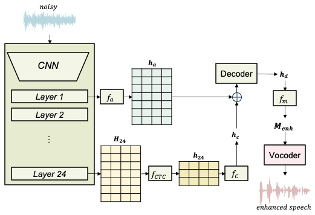

### Accepted to IWAENC 2026 (Paper number: 111)

## Abstract

Recent neural speech enhancement (SE) systems leveraging pre-trained speech self-supervised learning (SSL) models have demonstrated strong performance. However, little attention has been paid to systematically analyzing how representations from different SSL layers can be utilized and how each contributes to SE performance. In this work, using early-layer SSL representations as primary acoustic features, we investigate the effects of incorporating contextual-related information extracted from deeper layer of the same SSL backbone. Experimental results reveal that compact contextual representations play a critical role in improving SE performance. 
Rather than relying on an embedding-level matching loss, we explicitly train the higher-layer representation with a text prediction loss, which reduces irrelevant information and encourages more informative contextual features for SE. Motivated by these findings, we propose a novel SE framework, termed Serom, which explicitly exploits compressed contextual representations derived from late SSL layers. The resulting representations are integrated through a decoder and converted into enhanced speech using a neural vocoder. Experimental evaluations demonstrate that the proposed approach achieves state-of-the-art performance in terms of speech quality, intelligibility, and speaker similarity.

## Sample

CVAE: "Towards Complex-Valued VAE-Based Distillation for Representation Learning in Speech Enhancement" in ITG, 2025  
LCT-GAN: “Study of Lightweight Transformer Architectures for Single-Channel Speech Enhancement” in EUSIPCO, 2025  
PASE: “PASE: Leveraging the Phonological Prior of WavLM for Low-Hallucination Generative Speech Enhancement” in AAAI, 2026  

<table style="width: 100%; word-wrap: normal; text-align: center;" borded="1" border-collapse="collapse">
<tr>
<td style="column-width: 50\%"><strong>Sample index</strong></td>
<td style="column-width: 20\%"><strong>1</strong></td>
<td style="column-width: 20\%"><strong>2</strong></td>
<td style="column-width: 20\%"><strong>3</strong></td>
<td style="column-width: 20\%"><strong>4</strong></td>
<td style="column-width: 20\%"><strong>5</strong></td>
<td style="column-width: 20\%"><strong>6</strong></td>
<td style="column-width: 20\%"><strong>7</strong></td>
</tr>
<tr>
<td style="column-width: 50\%"><strong>Noisy</strong></td>
 <td><audio controls><source src='./demo_sample/8463-294828-0022_with_reverb_snr-5_noisy'></audio></td>
<td><audio controls><source src='./demo_sample/7176-92135-0018_no_reverb_snr-5_noisy'></audio></td>
<td><audio controls><source src='./demo_sample/61-70968-0058_with_reverb_snr-5_noisy'></audio></td>
<td><audio controls><source src='./demo_sample/121-127105-0016_with_reverb_snr-5_noisy'></audio></td>
<td><audio controls><source src='./demo_sample/1320-122612-0007_with_reverb_snr-5_noisy'></audio></td>
<td><audio controls><source src='./demo_sample/2830-3980-0015_with_reverb_snr5_noisy'></audio></td>
<td><audio controls><source src='./demo_sample/3570-5696-0004_with_reverb_snr-5_noisy'></audio></td>
</tr>
<tr>
 
</tr>
<tr>
<td style="column-width: 50\%"><strong>Reference</strong></td>
 <td><audio controls><source src='./demo_sample/8463-294828-0022_with_reverb_snr-5_clean'></audio></td>
<td><audio controls><source src='./demo_sample/7176-92135-0018_no_reverb_snr-5_clean'></audio></td>
<td><audio controls><source src='./demo_sample/61-70968-0058_with_reverb_snr-5_clean'></audio></td>
<td><audio controls><source src='./demo_sample/121-127105-0016_with_reverb_snr-5_clean'></audio></td>
<td><audio controls><source src='./demo_sample/1320-122612-0007_with_reverb_snr-5_clean'></audio></td>
<td><audio controls><source src='./demo_sample/2830-3980-0015_with_reverb_snr5_clean'></audio></td>
<td><audio controls><source src='./demo_sample/3570-5696-0004_with_reverb_snr-5_clean'></audio></td>
</tr>
<tr>
<td style="column-width: 50\%"><strong>CVAE</strong></td>
<td><audio controls><source src='./demo_sample/8463-294828-0022_with_reverb_snr-5_cvae'></audio></td>
<td><audio controls><source src='./demo_sample/7176-92135-0018_no_reverb_snr-5_cvae'></audio></td>
<td><audio controls><source src='./demo_sample/61-70968-0058_with_reverb_snr-5_cvae'></audio></td>
<td><audio controls><source src='./demo_sample/121-127105-0016_with_reverb_snr-5_cvae'></audio></td>
<td><audio controls><source src='./demo_sample/1320-122612-0007_with_reverb_snr-5_cvae'></audio></td>
<td><audio controls><source src='./demo_sample/2830-3980-0015_with_reverb_snr5_cvae'></audio></td>
<td><audio controls><source src='./demo_sample/3570-5696-0004_with_reverb_snr-5_cvae'></audio></td>
</tr>
<tr>
<td style="column-width: 50\%"><strong>LCT-GAN</strong></td>
<td><audio controls><source src='./demo_sample/8463-294828-0022_with_reverb_snr-5_lctgan'></audio></td>
<td><audio controls><source src='./demo_sample/7176-92135-0018_no_reverb_snr-5_lctgan'></audio></td>
<td><audio controls><source src='./demo_sample/61-70968-0058_with_reverb_snr-5_lctgan'></audio></td>
<td><audio controls><source src='./demo_sample/121-127105-0016_with_reverb_snr-5_lctgan'></audio></td>
<td><audio controls><source src='./demo_sample/1320-122612-0007_with_reverb_snr-5_lctgan'></audio></td>
<td><audio controls><source src='./demo_sample/2830-3980-0015_with_reverb_snr5_lctgan'></audio></td>
<td><audio controls><source src='./demo_sample/3570-5696-0004_with_reverb_snr-5_lctgan'></audio></td>
<tr>
<td style="column-width: 50\%"><strong>PASE</strong></td>
 <td><audio controls><source src='./demo_sample/8463-294828-0022_with_reverb_snr-5_pase'></audio></td>
<td><audio controls><source src='./demo_sample/7176-92135-0018_no_reverb_snr-5_pase'></audio></td>
<td><audio controls><source src='./demo_sample/61-70968-0058_with_reverb_snr-5_pase'></audio></td>
<td><audio controls><source src='./demo_sample/121-127105-0016_with_reverb_snr-5_pase'></audio></td>
<td><audio controls><source src='./demo_sample/1320-122612-0007_with_reverb_snr-5_pase'></audio></td>
<td><audio controls><source src='./demo_sample/2830-3980-0015_with_reverb_snr5_pase'></audio></td>
<td><audio controls><source src='./demo_sample/3570-5696-0004_with_reverb_snr-5_pase'></audio></td>
</tr>
<tr>
<td style="column-width: 50\%"><strong>Serom (Ours)</strong></td>
  <td><audio controls><source src='./demo_sample/8463-294828-0022_with_reverb_snr-5_serom'></audio></td>
<td><audio controls><source src='./demo_sample/7176-92135-0018_no_reverb_snr-5_serom'></audio></td>
<td><audio controls><source src='./demo_sample/61-70968-0058_with_reverb_snr-5_serom'></audio></td>
<td><audio controls><source src='./demo_sample/121-127105-0016_with_reverb_snr-5_serom'></audio></td>
<td><audio controls><source src='./demo_sample/1320-122612-0007_with_reverb_snr-5_serom'></audio></td>
<td><audio controls><source src='./demo_sample/2830-3980-0015_with_reverb_snr5_serom'></audio></td>
<td><audio controls><source src='./demo_sample/3570-5696-0004_with_reverb_snr-5_serom'></audio></td>
</tr>
   
